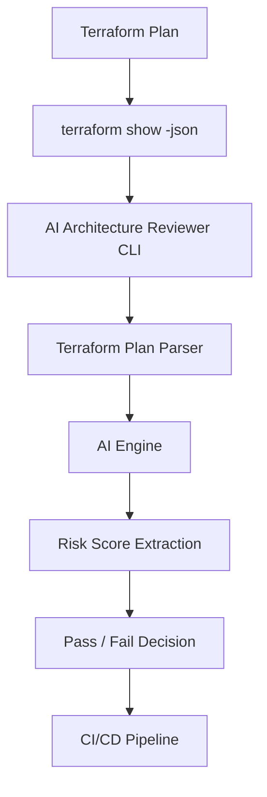

# 🔐 AI Architecture Reviewer (CLI)


AI-powered CLI tool that reviews Terraform infrastructure and architecture designs for security risks before deployment.

Built for DevSecOps pipelines to enforce **secure-by-design infrastructure**.

---

## 🚀 Why This Project?

Traditional IaC scanners rely only on static rules.  
This tool combines:

- Terraform plan inspection
- AI-based architecture analysis
- Configurable risk thresholds
- Pipeline enforcement

It enables security validation at **Pull Request stage**.

---

## 🏗 Architecture Overview


## 📦 Installation

### 1. Clone Repository

```bash
git clone repo_url
cd ai-architecture-reviewer
```
### 1. Configuration of utlity
```bash
python3 -m venv venv
source venv/bin/activate
pip install -r requirements.txt
pip install -e .
arch-reviewer --help
------------------------------
Create .env file in project root  (No .env file needed in pipeline, must be fetched from GitHub Secrets or Variables )
In .env file
    OPENAI_API_KEY=your_openai_key
    GEMINI_API_KEY=your_gemini_key # Optional (if using Gemini)

-------------------------------
Create arch-reviewer.yaml in project root


In arch-reviewer.yaml--
ai:
  provider: openai        # openai | gemini
  model: gpt-4o-mini
  temperature: 0.2

risk:
  fail_on: HIGH           # LOW | MEDIUM | HIGH | CRITICAL

output:
  format: text

--------------------------------
Usage -
arch-reviewer review tfplan.json
arch-reviewer review main.tf
arch-reviewer review architecture.txt

